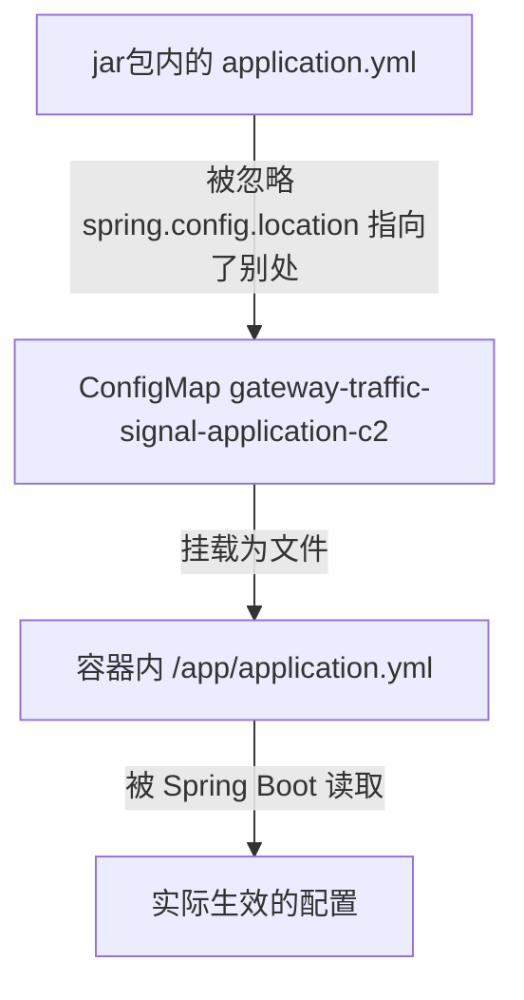

---

date: '2025-07-14T13:22:56+08:00'
draft: false
title: 'application.yml配置项不生效的问题'
tags: ["k8s","docker","运维"]
categories: ["gq"]
---

# 起因

事件的起因本来是在信号机服务的application.yml中配置了4个IP地址，但是服务启动后死活只加载了2个IP地址，非常奇怪，后来查了一下K8S才知道ConfigMap没有配置。

ConfigMap只配置了2个IP地址，而application.yml中配置了4个，但是这个服务的yml配置文件指定了Springboot不使用镜像自带的application.yml，而是使用外挂的配置文件，所以导致了这个问题。

# 分析

springboot的配置优先级为：
1. 命令行参数 (--signal.clients.c1.ip=xxx)
2. 环境变量
3. 外部配置文件（如挂载的 ConfigMap）
4. jar 包内的 application.yml ← 优先级最低

K8s 里的 ConfigMap通常会通过挂载文件或环境变量的方式注入，优先级高于 jar 内的 application.yml，所以本地改 application.yml不会影响容器里运行的服务。改配置需要对应修改ConfigMap。

```yml
# 方式一：挂载为文件（最常见的一种）
  volumeMounts:
    - name: config
      mountPath: /config
  volumes:
    - name: config
      configMap:
        name: my-config # 启动命令通常加：java -jar app.jar --spring.config.location=/config/
# 方式二：注入为环境变量
  env:
    - name: SIGNAL_PORT
      value: "29999"
```

一些常用的指令：

```shell
1. 查看 ConfigMap 内容
kubectl get configmap <configmap名> -o yaml

2. 查看 Pod 的环境变量和挂载
# 查看环境变量
kubectl exec <pod名> -- env

# 查看挂载的文件
kubectl exec <pod名> -- ls /config/

# 查看容器启动命令
kubectl get pod <pod名> -o yaml | grep -A5 command

3. 查看实际生效的配置（最直接）
# 查看 Spring 加载了哪些配置源
kubectl logs <pod名> | grep "PropertySource"

# 或者启动时加 debug 参数查看
kubectl logs <pod名> | grep "Loading"

4. 用 Spring Boot Actuator 查看（如果有暴露）
kubectl exec <pod名> -- curl localhost:8080/actuator/env
```

而在我的服务中：

```yaml
# 1. 启动路径参数
command:             
    - java
    - '-jar'
    - /app/app.jar
    - '--spring.profiles.active=prod'
    - '--spring.config.location=file:/app/application.yml'  # 👈 这里
  告诉 Spring Boot：去 /app/application.yml 读配置，不要用 jar 包里的。

# 2. ConfigMap 挂载覆盖了那个路径
  volumeMounts:
    - mountPath: /app/application.yml    # 👈 覆盖了启动命令指定的路径
      name: volume-ndeyn
      subPath: application.yml
  把 ConfigMap 的内容挂载为文件，正好覆盖 /app/application.yml。

# 3. ConfigMap 的来源
  volumes:
    - configMap:
        name: gateway-traffic-signal-application-c2   # 👈 这个 ConfigMap
      name: volume-ndeyn
```

# 流程总结




所以本地改 gq_traffic_controller/src/main/resources/application.yml 是没用的。要改配置需要更新 ConfigMap：

```shell
# 查看当前 ConfigMap 内容
kubectl get configmap gateway-traffic-signal-application-c2 -n guoqi -o yaml
# 编辑 ConfigMap
kubectl edit configmap gateway-traffic-signal-application-c2 -n guoqi
```
修改 ConfigMap 后需要重启 Pod 才能生效（因为不是所有 Spring 配置都支持热更新）。

